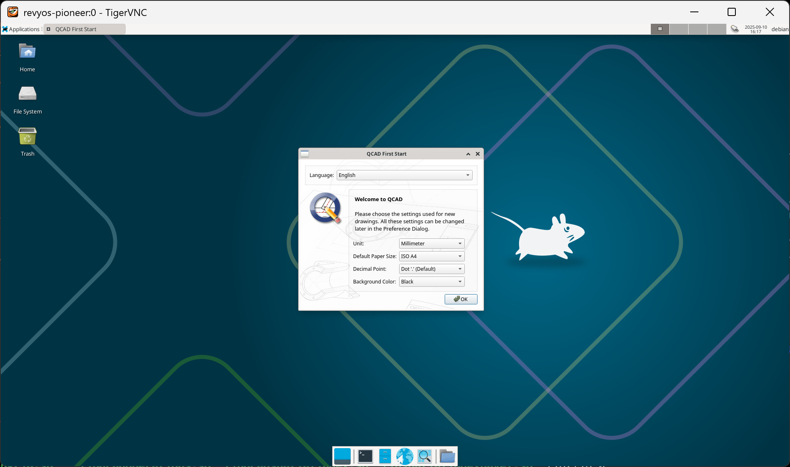

### 在 RevyOS 上安装 QCad

QCad 是一个用于二维设计及绘图的计算机辅助设计软件，支持 Linux、Mac OS X、Unix 及 Microsoft Windows 操作系统。

QCad 目前并未提供适用于 riscv64 架构的二进制包，因而需要自行构建。

#### 构建 QCad

安装构建依赖：
```bash
sudo apt update
sudo apt install git build-essential gcc make libx11-dev libxext-dev libxrender-dev libglu1-mesa-dev libfreetype6-dev libfontconfig1-dev libssl-dev libdbus-1-dev libsm-dev gcc make libx11-dev libxext-dev libxrender-dev libglu1-mesa-dev libfreetype6-dev libfontconfig1-dev libssl-dev libdbus-1-dev libsm-dev qt5-qmake libqt5svg5-dev libqt5script5 libqt5help5 libqt5designer5 libqt5scripttools5 qtscript5-dev qtxmlpatterns5-dev-tools libqt5xmlpatterns5 libqt5xmlpatterns5-dev libqt5designer5 python3-pyside2.qtuitools libqscintilla2-qt5-designer libqt5designer5 qttools5-dev qt5-image-formats-plugins qtwayland5 qtwayland5-dev-tools libqt5waylandclient5
```

拉取源代码并开始构建：

```shell
git clone https://github.com/qcad/qcad.git --depth=1
cd qcad
# 提示：Debian Trixie 提供了 Qt 5.15.15，需要手动添加以下内容
mkdir -p src/3rdparty/qt-labs-qtscriptgenerator-5.15.15
cat << 'EOF' > src/3rdparty/qt-labs-qtscriptgenerator-5.15.15/qt-labs-qtscriptgenerator-5.15.15.pro
include( ../../../shared.pri )

SUBDIRS = ../qt-labs-qtscriptgenerator-5.5.0/qtbindings
TEMPLATE = subdirs
EOF
qmakr -r CONFIG+=ractivated
make release -j$(nproc)
```

#### 在 Milk-V Pioneer 上运行

直接运行：

```shell
./release/qcad-bin
```

设置向导：



程序界面：

