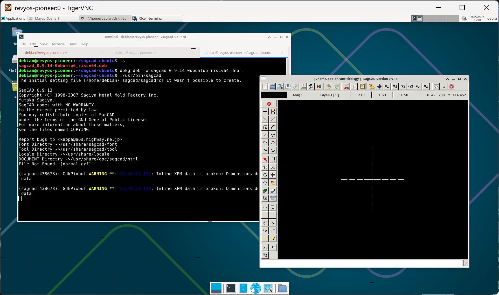

### SagCAD on RevyOS

SagCAD is an easy to use 2D CAD/CAM software.

#### Installing SagCAD

Debian/RevyOS currently does not provide SagCAD in their repos, while you can download the Ubuntu package and run it manually.

Warning: DO NOT try directly installing deb packages from Ubuntu or other distributions, which will cause unforeseen consequences and may damage the system!

```shell
mkdir sagcad; cd sagcad
wget http://launchpadlibrarian.net/722730855/sagcad_0.9.14-0ubuntu6_riscv64.deb
dpkg-deb -x sagcad_0.9.14-0ubuntu6_riscv64.deb .
```

#### Running SagCAD on Milk-V Pioneer

```shell
./usr/bin/sagcad
```

Runs fine on Milk-V Pioneer.

