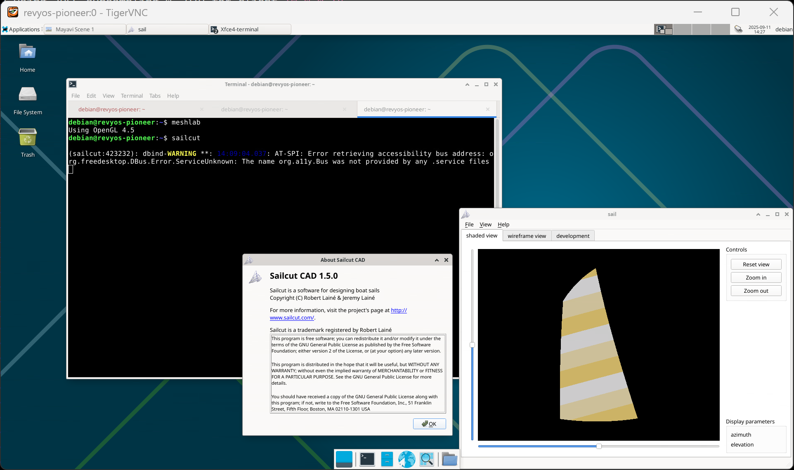

### Install Sailcut CAD on RevyOS

Sailcut CAD is a software for designing boat sails and developing them into flat panels.

#### Installation

You can use `apt` to install.

```bash
sudo apt update; sudo apt install -y sailcut
```

#### Running on Milk-V Pioneer

Sailcut CAD runs fine on Milk-V Pioneer.

