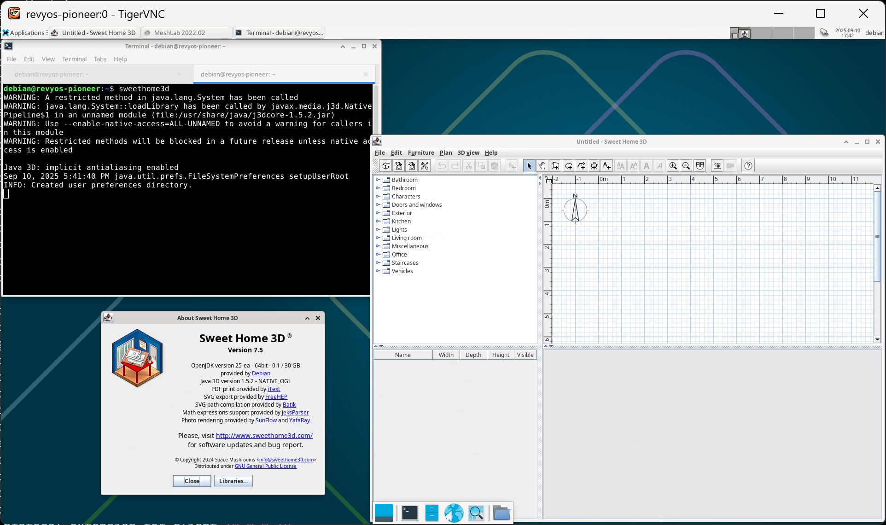

### Install Sweet Home 3D on RevyOS

From [Wikipedia](https://en.wikipedia.org/wiki/Sweet_Home_3D):

> Sweet Home 3D is a free and open source architectural design software that helps users create a 2D plan of a house, with a 3D preview, and decorate exterior and interior views, including ability to place furniture and home appliances. In Sweet Home 3D, furniture can be imported and arranged to create a virtual environment. It can also be used for designing blueprints of houses.

#### Installation

You can use `apt` to install.

```bash
sudo apt update; sudo apt install -y sweethome3d
```

#### Running on Milk-V Pioneer

Works fine on Milk-V Pioneer.


