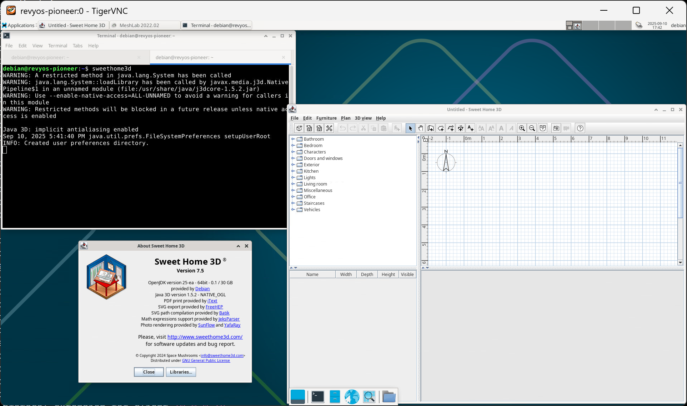

### 在 RevyOS 上安装 Sweet Home 3D

来自维基百科（翻译至中文）：

> Sweet Home 3D 是一款免费开源建筑设计软件，可帮助用户创建房屋的 2D 平面图，并提供 3D 预览，并装饰外部和内部视图，包括放置家具和家用电器的能力。在 Sweet Home 3D 中，可以导入并排列家具以创建虚拟环境。它还可以用于设计房屋蓝图。

#### 安装

可以使用 `apt` 包管理器执行安装。

```bash
sudo apt update; sudo apt install -y sweethome3d
```

#### 在 Milk-V Pioneer 上运行

安装在 Milk-V Pioneer 上运行正常。

