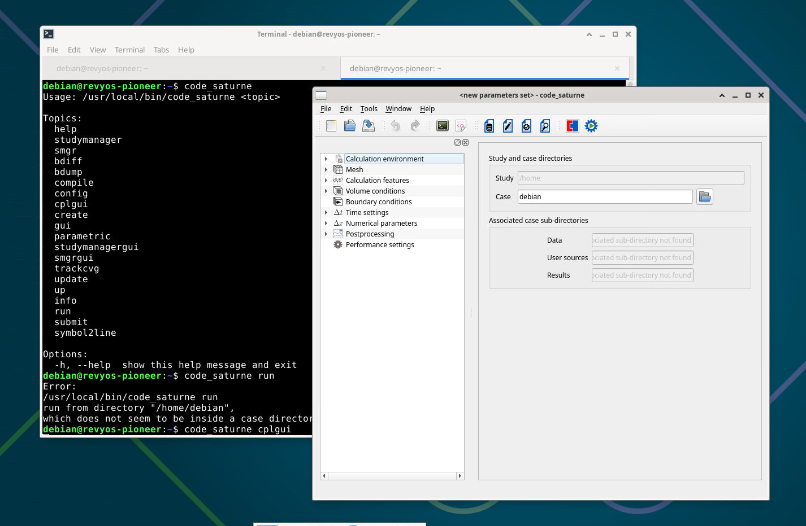

# Code Saturne (CFD) on RevyOS

## 安装准备

查看 [安装文档](https://github.com/code-saturne/code_saturne/blob/master/INSTALL.md)

```
sudo apt install python3-pyqt5 pyqt5-dev-tools gfortran
```

## 获取源代码

```
wget https://www.code-saturne.org/releases/code_saturne-9.0.0.tar.gz
tar -xzvf code_saturne-9.0.0.tar.gz
```

## 编译和安装

```
mkdir code_saturne_build
cd code_saturne_build
mkdir prod
cd prod
../../code_saturne-9.0.0/configure
make
sudo make install
```

## 验证


