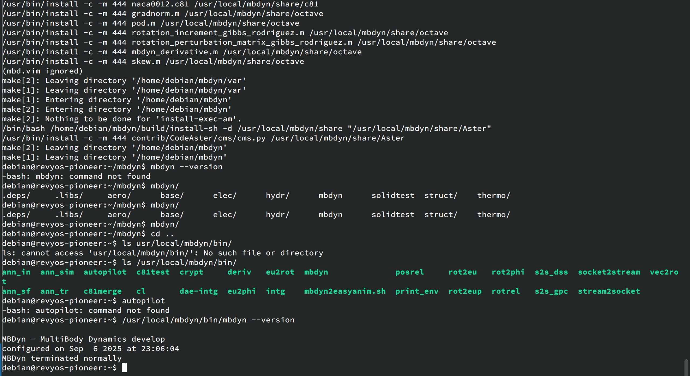

# Install MBDyn on RevyOS

## Install Dependencies
Required dependencies:
```bash
apt install make gcc g++ gfortran # deps
apt install autoconf automake libtool autotools-dev # dev_deps
```

Optional dependencies:
```bash
apt install libltdl-dev liblapack-dev libsuitesparse-dev libnetcdf-dev libnetcdf-dev
```

## Fetch source code
```bash
git clone https://public.gitlab.polimi.it/DAER/mbdyn.git
cd mbdyn
git checkout develop
```

## Building
### Modify source code to fix compilation errors
Apply the following patch:

```diff
diff --git a/libraries/libmbmath/sp_gradient_test.cc b/libraries/libmbmath/sp_gradient_test.cc
index 9bdc4298d..ee2b5a3d3 100644
--- a/libraries/libmbmath/sp_gradient_test.cc
+++ b/libraries/libmbmath/sp_gradient_test.cc
@@ -45,10 +45,10 @@
 #include <fenv.h>
 #endif // HAVE_FENV_H

-#if _POSIX_C_SOURCE >= 200809L
+//#if _POSIX_C_SOURCE >= 200809L
 #include <sys/time.h>
 #include <sys/resource.h>
-#endif
+//#endif

 #include <algorithm>
 #include <chrono>
```

### Configure and build

```bash
sh bootstrap.sh
./configure
make
make install
```

## Result

