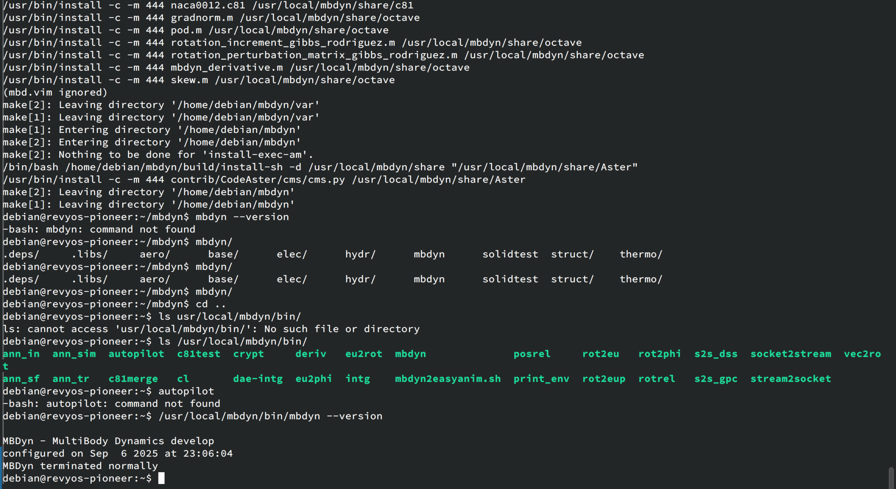

# 指南：在 RevyOS 上构建 MBDyn

本文档提供了在运行 RevyOS 的 RISC-V 设备上构建 MBDyn 软件的说明。

## 第一步: 安装依赖
需要的依赖:
```bash
apt install make gcc g++ gfortran # deps
apt install autoconf automake libtool autotools-dev # dev_deps
```

可选的依赖:
```bash
apt install libltdl-dev liblapack-dev libsuitesparse-dev libnetcdf-dev libnetcdf-dev
```

## 第二部: 获取源代码
```bash
git clone https://public.gitlab.polimi.it/DAER/mbdyn.git
cd mbdyn
git checkout develop
```

## 第三步: Building
### 修改源代码以修复编译错误
使用下面的 patch:

```diff
diff --git a/libraries/libmbmath/sp_gradient_test.cc b/libraries/libmbmath/sp_gradient_test.cc
index 9bdc4298d..ee2b5a3d3 100644
--- a/libraries/libmbmath/sp_gradient_test.cc
+++ b/libraries/libmbmath/sp_gradient_test.cc
@@ -45,10 +45,10 @@
 #include <fenv.h>
 #endif // HAVE_FENV_H

-#if _POSIX_C_SOURCE >= 200809L
+//#if _POSIX_C_SOURCE >= 200809L
 #include <sys/time.h>
 #include <sys/resource.h>
-#endif
+//#endif

 #include <algorithm>
 #include <chrono>
```

### 配置并构建

```bash
sh bootstrap.sh
./configure
make
make install
```

## 结果

