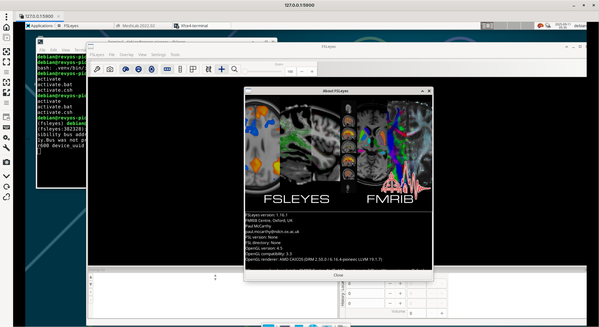

According to [18e3ba](https://git.fmrib.ox.ac.uk/fsl/fslview/-/commit/18e3ba31572f6e3a9a3a3a3fe6eb9c271b45c56a), FSLView is deprecated since 2017.

But the [changelog](https://git.fmrib.ox.ac.uk/fsl/docs/-/tree/main/docs/development/history?ref_type=heads) says FSLeyes provided with "FSLView" mode for viewing legacy data sets. So we are going to build FSL and test on RevyOS instead.

Documentation for FSL install on Linux is available [here](https://fsl.fmrib.ox.ac.uk/fsl/docs/#/install/linux).

The installer script recommended in official documentation is not working for riscv architecture, so we are going to build from source.

```bash
ezra@revyos-pioneer:~$ curl -Ls https://fsl.fmrib.ox.ac.uk/fsldownloads/fslconda/releases/getfsl.sh | sh -s
Cannot identify platform!

Re-run this script and specify your platform via 
an environment variable called FSLPLATFORM, e.g.:

For Linux (Intel):
  FSLPLATFORM=linux-64 sh getfsl.sh [fsldir]

For macOS (Intel):
  FSLPLATFORM=macos-64 sh getfsl.sh [fsldir]

For macOS (Apple Silicon):
  FSLPLATFORM=macos-M1 sh getfsl.sh [fsldir]
ezra@revyos-pioneer:~$ 
```

You could found source code in [FSL](https://git.fmrib.ox.ac.uk/fsl/fsleyes/fsleyes).

Luckily, we could install FSLeyes from [PyPI](https://fsl.fmrib.ox.ac.uk/fsl/docs/#/utilities/fsleyes?id=install-from-pypi-advanced), that will be easier.

### **Guide: Building FSL on RevyOS (RISC-V)**

This guide provides instructions for building the FSL (FMRIB Software Library) on a RISC-V device running RevyOS. The process involves setting up the build environment, downloading the source code, and compiling the software.

#### Prerequisites

Some basic development tools are required for the build process.

```bash
sudo apt-get update
sudo apt-get install python3-dev \
    build-essential \
    libgtk-3-dev \
    libwebkit2gtk-4.1-dev \
    libjpeg62-turbo-dev \
    libtiff-dev \
    libsdl2-dev \
    libgstreamer1.0-dev \
    libgstreamer-plugins-base1.0-dev \
    libnotify-dev \
    freeglut3-dev \
    libopenblas-dev
```

#### Building FSLeyes

Just run `uv pip install fsleyes`.

```bash
(fsleyes) debian@revyos-pioneer:~/fsleyes$ uv pip install fsleyes
Resolved 23 packages in 803ms
      Built wxpython==4.2.3
      Built h5py==3.14.0
      Built scipy==1.16.1
Prepared 3 packages in 21m 01s
Installed 23 packages in 285ms
 + contourpy==1.3.3
 + cycler==0.12.1
 + dill==0.4.0
 + fonttools==4.59.2
 + fsleyes==1.16.1
 + fsleyes-props==1.12.2
 + fsleyes-widgets==0.15.1
 + fslpy==3.23.0
 + h5py==3.14.0
 + jinja2==3.1.6
 + kiwisolver==1.4.9
 + markupsafe==3.0.2
 + matplotlib==3.10.6
 + nibabel==5.3.2
 + numpy==2.3.3
 + packaging==25.0
 + pillow==11.3.0
 + pyopengl==3.1.10
 + pyparsing==3.2.3
 + python-dateutil==2.9.0.post0
 + scipy==1.16.1
 + six==1.17.0
 + wxpython==4.2.3
(fsleyes) debian@revyos-pioneer:~/fsleyes$ 
```

