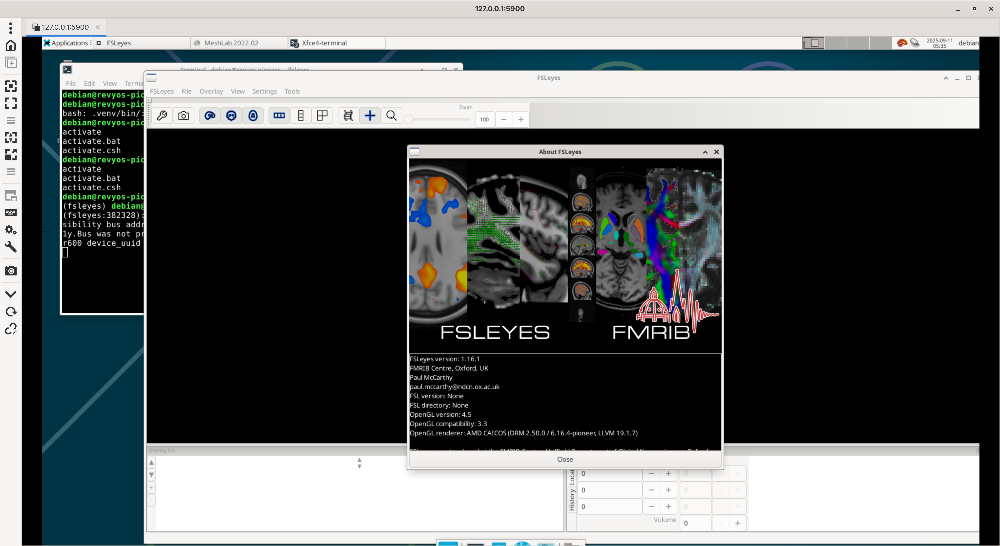

根据[18e3ba](https://git.fmrib.ox.ac.uk/fsl/fslview/-/commit/18e3ba31572f6e3a9a3a3a3fe6eb9c271b45c56a)，FSLView 自 2017 年起已弃用。

但[变更日志](https://git.fmrib.ox.ac.uk/fsl/docs/-/tree/main/docs/development/history?ref_type=heads)显示 FSLeyes 提供了 "FSLView" 模式用于查看传统数据集。因此我们将在 RevyOS 上构建 FSL 并进行测试。

FSL 在 Linux 上的安装文档可在[这里](https://fsl.fmrib.ox.ac.uk/fsl/docs/#/install/linux)找到。

官方文档中推荐的安装程序脚本不适用于 riscv 架构，因此我们将从源代码构建。

```bash
ezra@revyos-pioneer:~$ curl -Ls https://fsl.fmrib.ox.ac.uk/fsldownloads/fslconda/releases/getfsl.sh | sh -s
Cannot identify platform!

Re-run this script and specify your platform via 
an environment variable called FSLPLATFORM, e.g.:

For Linux (Intel):
  FSLPLATFORM=linux-64 sh getfsl.sh [fsldir]

For macOS (Intel):
  FSLPLATFORM=macos-64 sh getfsl.sh [fsldir]

For macOS (Apple Silicon):
  FSLPLATFORM=macos-M1 sh getfsl.sh [fsldir]
ezra@revyos-pioneer:~$ 
```

您可以在[FSL](https://git.fmrib.ox.ac.uk/fsl/fsleyes/fsleyes)中找到源代码。

幸运的是，我们可以从[PyPI](https://fsl.fmrib.ox.ac.uk/fsl/docs/#/utilities/fsleyes?id=install-from-pypi-advanced)安装 FSLeyes，这样会更简单。

### **指南：在 RevyOS (RISC-V) 上构建 FSL**

本指南提供了在运行 RevyOS 的 RISC-V 设备上构建 FSL（FMRIB 软件库）的说明。该过程涉及设置构建环境、下载源代码和编译软件。

#### 先决条件

构建过程需要一些基本的开发工具。

```bash
sudo apt-get update
sudo apt-get install python3-dev \
    build-essential \
    libgtk-3-dev \
    libwebkit2gtk-4.1-dev \
    libjpeg62-turbo-dev \
    libtiff-dev \
    libsdl2-dev \
    libgstreamer1.0-dev \
    libgstreamer-plugins-base1.0-dev \
    libnotify-dev \
    freeglut3-dev \
    libopenblas-dev
```

#### 构建 FSLeyes

只需运行 `uv pip install fsleyes`。

```bash
(fsleyes) debian@revyos-pioneer:~/fsleyes$ uv pip install fsleyes
Resolved 23 packages in 803ms
      Built wxpython==4.2.3
      Built h5py==3.14.0
      Built scipy==1.16.1
Prepared 3 packages in 21m 01s
Installed 23 packages in 285ms
 + contourpy==1.3.3
 + cycler==0.12.1
 + dill==0.4.0
 + fonttools==4.59.2
 + fsleyes==1.16.1
 + fsleyes-props==1.12.2
 + fsleyes-widgets==0.15.1
 + fslpy==3.23.0
 + h5py==3.14.0
 + jinja2==3.1.6
 + kiwisolver==1.4.9
 + markupsafe==3.0.2
 + matplotlib==3.10.6
 + nibabel==5.3.2
 + numpy==2.3.3
 + packaging==25.0
 + pillow==11.3.0
 + pyopengl==3.1.10
 + pyparsing==3.2.3
 + python-dateutil==2.9.0.post0
 + scipy==1.16.1
 + six==1.17.0
 + wxpython==4.2.3
(fsleyes) debian@revyos-pioneer:~/fsleyes$ 
```

