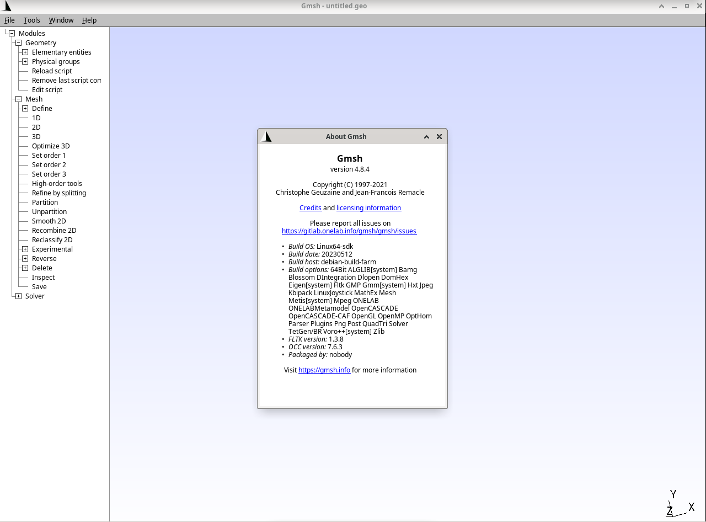

### **Guide: Installing GMSH on RevyOS**

This document provides instructions for installing the `GMSH` finite element analysis (FEA) pre- and post-processing tool on a RISC-V device running the RevyOS Debian derivative. As the `GMSH` package is available in the RevyOS repositories, the installation process will be easy.

```bash
debian@revyos-lpi4a:~$ sudo apt install gmsh
Installing:                     
  gmsh

Installing dependencies:
  gmsh-doc       libfltk-images1.3  libgl2ps1.4                libocct-draw-7.6                 libocct-modeling-data-7.6  libtcl8.6   occt-misc
  libalglib3.19  libfltk1.3         libgmsh4.8                 libocct-foundation-7.6           libocct-ocaf-7.6           libtk8.6
  libfltk-gl1.3  libfreeimage3      libocct-data-exchange-7.6  libocct-modeling-algorithms-7.6  libocct-visualization-7.6  libvoro++1

Suggested packages:
  tcl8.6  tk8.6

Summary:
  Upgrading: 0, Installing: 20, Removing: 0, Not Upgrading: 0
  Download size: 44.5 MB
  Space needed: 171 MB / 94.8 GB available

Continue? [Y/n] 
```



The `GMSH` package is now installed and ready to use, rendering and working correctly but a bit slow.