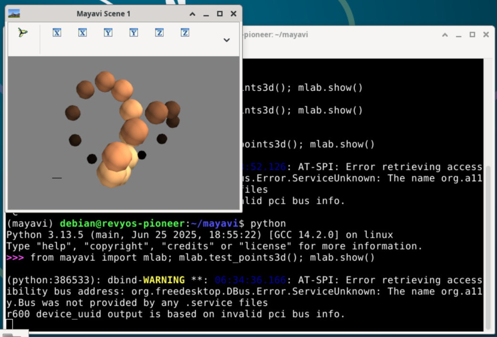

### **Guide: Installing Mayavi on RevyOS (RISC-V) using a Hybrid Approach**

This document provides instructions for installing the Mayavi 3D visualization library from source on a RISC-V device running a modern Debian-based system (like RevyOS on the Trixie branch). The standard `pip` or `uv` installation fails due to a lack of pre-compiled binary "wheels" for critical dependencies like VTK and UI toolkits on the RISC-V architecture, especially when combined with a new Python version (e.g., 3.13).

This guide details a robust **hybrid method**: using the system package manager (`apt`) for the heaviest dependency (VTK) and `uv` for Mayavi itself, its UI backend (`wxPython`), and its pure-Python dependencies.

Official documentation: [Mayavi Installation Guide](https://docs.enthought.com/mayavi/mayavi/installation.html)

#### Prerequisites

A working development environment is essential, including `git` to obtain the source code and `uv` as the Python package installer. This guide also requires build tools for compiling `wxPython` if binary wheels are unavailable.

The following command can be used to install all required dependencies:

```bash
sudo apt-get update && sudo apt-get -y install \
    git \
    uv \
    build-essential \
    python3-vtk9 \
    libgtk-3-dev
```
*Note: `build-essential` and `libgtk-3-dev` are included as they are common requirements for building `wxPython` from source.*

#### Step 1: Obtain the Source Code

First, clone the official Mayavi source code repository from GitHub.

```bash
git clone https://github.com/enthought/mayavi.git
cd mayavi
```

#### Step 2: Create a Specialized Virtual Environment

To link the system-installed VTK with our local Python project, we must create a virtual environment that has access to the system's site-packages. This is the key to the hybrid approach.

```bash
# Inside the 'mayavi' source directory
# Create the venv, allowing it to see system packages
uv venv --system-site-packages

# Activate the new virtual environment (named .venv by default)
source .venv/bin/activate
```
After activation, your command prompt will be prefixed with `(.venv)`.

#### Step 3: Perform the Manual, Two-Stage Installation

This is the most critical step. The standard installation process fails due to a Catch-22: the dependency resolver and the build script both need VTK but cannot find it in the standard Python package index (PyPI). We bypass this by manually controlling the installation in two stages.

1.  **Install Mayavi Itself, Ignoring Dependencies**

    First, we build and install Mayavi from the local source code. We use two crucial flags:
    *   `--no-build-isolation`: Forces the build to run in our main virtual environment, where the system VTK is visible.
    *   `--no-deps`: Prevents the installer from checking for or installing any dependencies from PyPI.

    ```bash
    # Ensure the .venv is active
    uv pip install --no-build-isolation --no-deps .
    ```
    This command will successfully build and install the `mayavi` package, and nothing else.

2.  **Manually Install Remaining Dependencies**

    Now that Mayavi is installed, we install its other dependencies (NumPy, the Enthought Tool Suite, and the `wxPython` UI backend) using `uv`. This ensures they are correctly registered within the virtual environment.

    ```bash
    uv pip install "numpy>=2.0" traits traitsui pyface envisage apptools wxPython
    ```

#### Verification

After activating the environment, you can verify that the complete installation is working correctly by running a test script from the command line.

```bash
python -c "from mayavi import mlab; print('SUCCESS: Mayavi and its dependencies are fully installed!'); mlab.test_points3d(); mlab.show()"
```

You should see the success message printed in your terminal, and a new window should appear displaying an interactive 3D plot. This confirms that Mayavi, VTK, and `wxPython` are all working together correctly.



### Why Use the Hybrid Approach?

The hybrid approach is necessary because `uv` (or `pip`) does not recognize the availability of precompiled `vtk>=9` packages for the RISC-V architecture. This leads to installation failures when attempting to install VTK via Python's package manager. However, the system package manager (`apt`) provides a compatible `vtk` package. By leveraging the `--system-site-packages` option in the virtual environment, we can directly use the system-installed `vtk` package, bypassing the need for a Python-specific installation. This ensures compatibility and resolves dependency issues effectively.