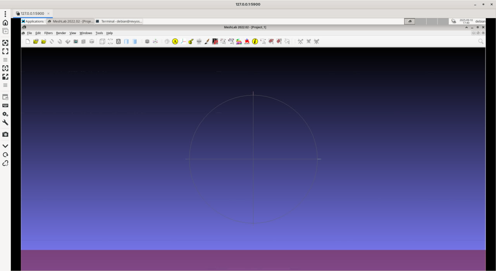
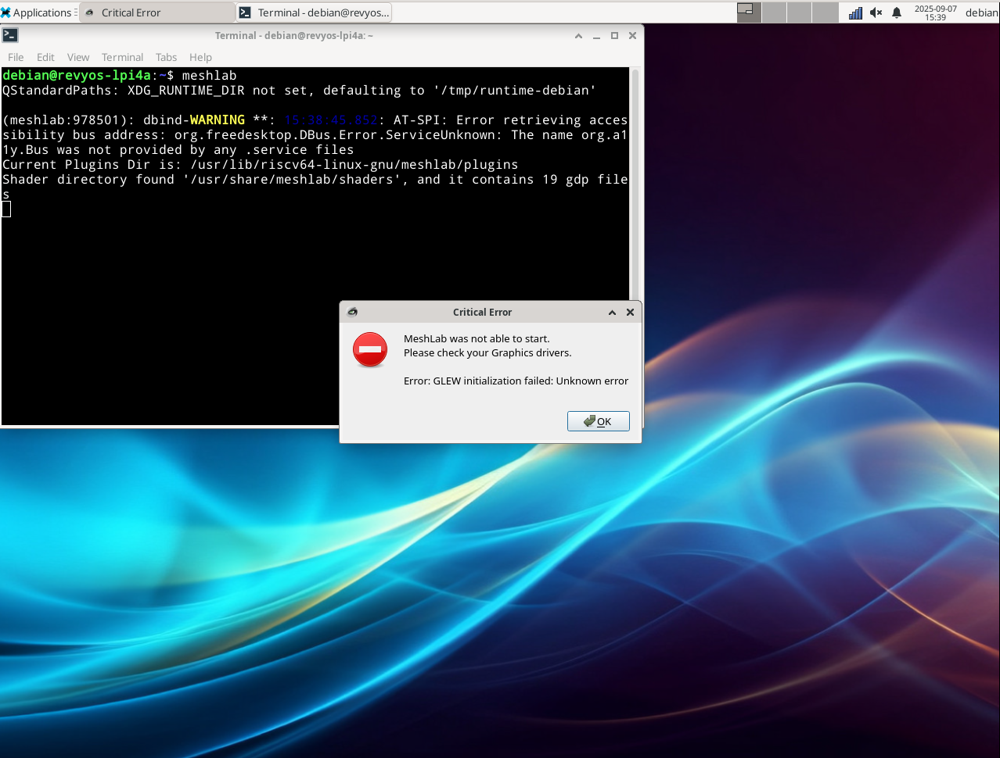
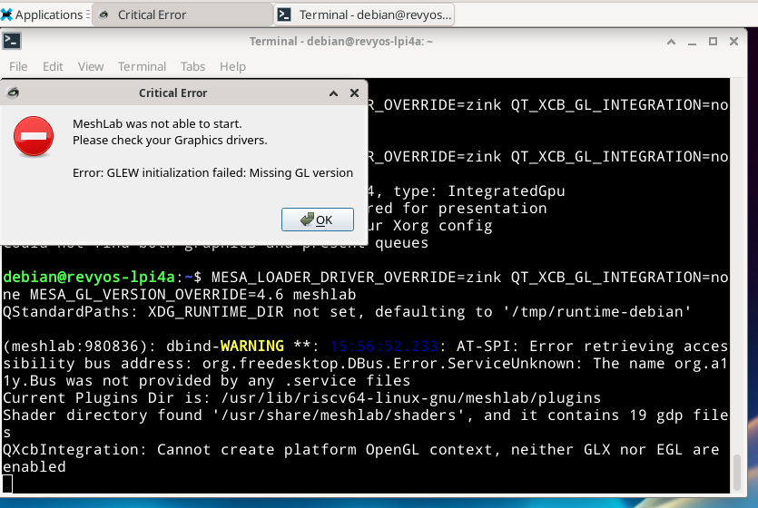

### **指南：在 RevyOS 上安装 MeshLab**

本文档提供了在运行 RevyOS 的 RISC-V 设备上安装 MeshLab（用于处理和编辑三角网格的系统）的说明。`meshlab` 包在 RevyOS 仓库中可用，使安装变得简单。

#### 安装

可以使用 `apt` 包管理器执行安装。

```bash
debian@revyos-lpi4a:~$ sudo apt install meshlab
[sudo] password for debian: 
Installing:                     
  meshlab

Installing dependencies:
  chemical-mime-data  lib3ds-1-3  libmuparser2v5  libopenctm1

Suggested packages:
  gnome-mime-data

Summary:
  Upgrading: 0, Installing: 5, Removing: 0, Not Upgrading: 0
  Download size: 5,130 kB
  Space needed: 20.8 MB / 89.1 GB available

Continue? [Y/n] y
Get:1 https://fast-mirror.isrc.ac.cn/revyos/revyos-base sid/main riscv64 chemical-mime-data all 0.1.94-7.2 [46.7 kB]
Get:2 https://fast-mirror.isrc.ac.cn/revyos/revyos-base sid/main riscv64 lib3ds-1-3 riscv64 1.3.0-10 [45.4 kB]
Get:3 https://fast-mirror.isrc.ac.cn/revyos/revyos-base sid/main riscv64 libmuparser2v5 riscv64 2.3.3-0.1 [135 kB]
Get:4 https://fast-mirror.isrc.ac.cn/revyos/revyos-base sid/main riscv64 libopenctm1 riscv64 1.0.3+dfsg1-2.1+b3 [47.5 kB]
Get:5 https://fast-mirror.isrc.ac.cn/revyos/revyos-base sid/main riscv64 meshlab riscv64 2020.09+dfsg1-2+b1 [4,856 kB]
Fetched 5,130 kB in 2s (3,127 kB/s)  
Selecting previously unselected package chemical-mime-data.
(Reading database ... 163906 files and directories currently installed.)
Preparing to unpack .../chemical-mime-data_0.1.94-7.2_all.deb ...
Unpacking chemical-mime-data (0.1.94-7.2) ...
Selecting previously unselected package lib3ds-1-3:riscv64.
Preparing to unpack .../lib3ds-1-3_1.3.0-10_riscv64.deb ...
Unpacking lib3ds-1-3:riscv64 (1.3.0-10) ...
Selecting previously unselected package libmuparser2v5:riscv64.
Preparing to unpack .../libmuparser2v5_2.3.3-0.1_riscv64.deb ...
Unpacking libmuparser2v5:riscv64 (2.3.3-0.1) ...
Selecting previously unselected package libopenctm1:riscv64.
Prepacking libopenctm1:riscv64 (1.0.3+dfsg1-2.1+b3) ...
Selecting previously unselected package meshlab.
Preparing to unpack .../meshlab_2020.09+dfsg1-2+b1_riscv64.deb ...
Unpacking meshlab (2020.09+dfsg1-2+b1) ...
Setting up lib3ds-1-3:riscv64 (1.3.0-10) ...
Setting up chemical-mime-data (0.1.94-7.2) ...
Setting up libopenctm1:riscv64 (1.0.3+dfsg1-2.1+b3) ...
Setting up libmuparser2v5:riscv64 (2.3.3-0.1) ...
Setting up meshlab (2020.09+dfsg1-2+b1) ...
Processing triggers for hicolor-icon-theme (0.17-2) ...
Processing triggers for libc-bin (2.40-3revyos1) ...
Processing triggers for man-db (2.11.2-2) ...
Processing triggers for shared-mime-info (2.2-1+b1) ...
Processing triggers for desktop-file-utils (0.26-1) ...
```

#### 在 Milk-V Pioneer 上运行正常

安装在 Milk-V Pioneer 上运行正常。图形和渲染均工作正常。

```bash
sudo x11vnc -many -display :0 -no6 -rfbport 5900 -auth //run/lightdm/root/:0
```

启用 x11vnc 硬件图形加速后：



#### LPi4A 上的问题

尽管安装成功，但 MeshLab 无法启动。它报告与 GLEW (OpenGL Extension Wrangler Library) 初始化相关的错误，这表明平台上的图形驱动程序或 OpenGL 上下文创建存在问题。



#### 渲染问题的解决方案

为了绕过图形驱动程序问题，我尝试了以下解决方案之一，但都没有成功：


