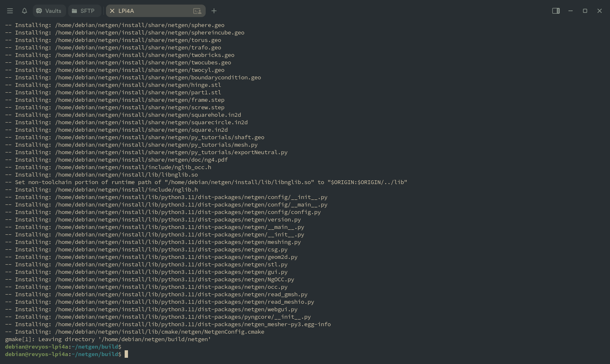
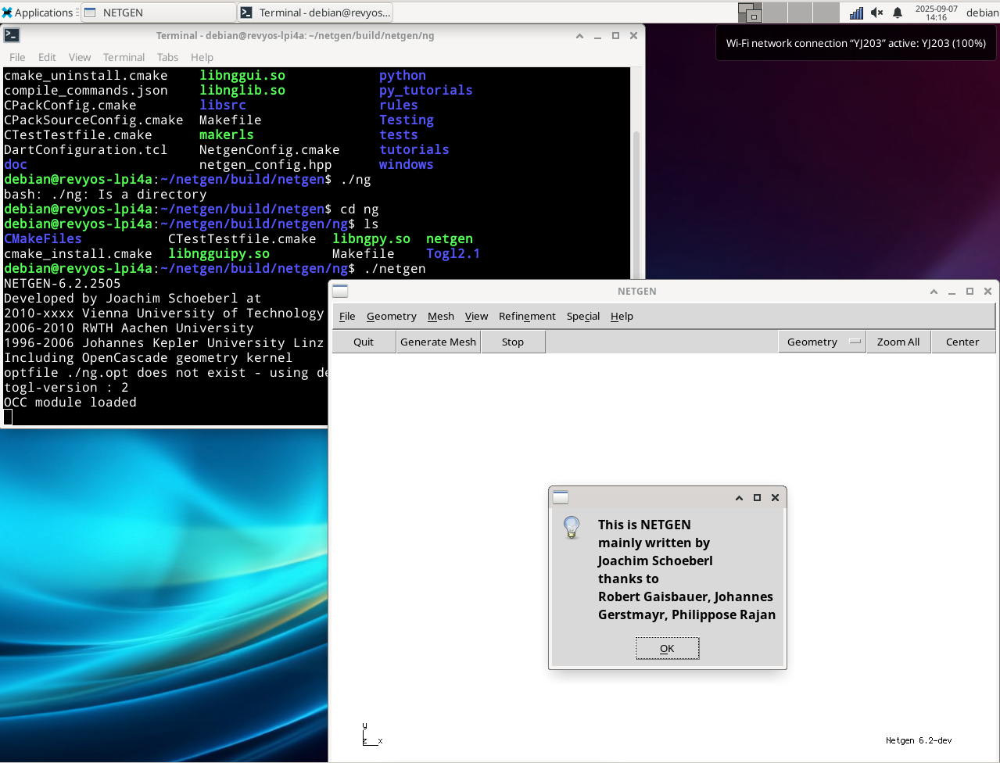

### **Guide: Building Netgen/NGSolve with OpenCASCADE on RevyOS (RISC-V)**

This document provides instructions for building the Netgen/NGSolve finite element software from source on a RISC-V device running RevyOS. The process details how to link against a manually compiled OpenCASCADE Technology (OCCT) library and addresses platform-specific compiler issues.

Official documentation: [Netgen/NGSolve - Build on Linux](https://ngsolve.org/docu/latest/install/source.html)

#### Prerequisites

A number of development packages are required for the build process. A working C++ toolchain (`g++`), `git`, and `cmake` are essential.

This guide also assumes you have already built and installed OpenCASCADE Technology from source. The build process described here will link to that existing installation. You could refer to documentation also in this repo: [Link](../OpenCASCADE/README.md).

The following command can be used to install the required dependencies on a Debian-based system like RevyOS:

```bash
sudo apt-get update && sudo apt-get -y install \
    g++ \
    git \
    cmake \
    python3-dev \
    python3-tk \
    tk-dev \
    tcl-dev \
    libxmu-dev \
    libglu1-mesa-dev \
    liblapacke-dev \
    libx11-dev \
    libxext-dev \
    libxi-dev
```

#### Step 1: Obtain the Source Code

First, clone the source code repository from GitHub. It is important to check out a specific version tag and initialize the git submodules, which are required for dependencies like `pybind11`.

```bash
# Clone the repository
git clone https://github.com/NGSolve/netgen.git

# Enter the source directory
cd netgen

# Check out lastest release (at documentation time is 6.2.2505)
git checkout v6.2.2505

# Initialize and download required submodules
git submodule update --init --recursive
```

#### Step 2: Modify the Build Configuration for RISC-V

The default build configuration attempts to use the `-march=native` compiler flag for performance optimization. On some RISC-V toolchains (RevyOS 20250420 GCC), this flag is not supported and will cause the build to fail.

To resolve this, the option must be disabled directly in the project's main `CMakeLists.txt` file.

1.  Open the `CMakeLists.txt` file in the root of the `netgen` source directory with a text editor.
    ```bash
    nano CMakeLists.txt
    ```

2.  Locate the following line (you can search for `ENABLE_NATIVE_ARCH`):
    ```cmake
    option(ENABLE_NATIVE_ARCH "Enable native architecture optimizations" ON)
    ```

3.  Change the value from `ON` to `OFF`:
    ```cmake
    option(ENABLE_NATIVE_ARCH "Enable native architecture optimizations" OFF)
    ```

4.  Save the file and exit the editor.

#### Step 3: Configure the Build with CMake

With the source code prepared, create separate directories for the build process and the final installation. Then, run `cmake` to configure the project, pointing it to your pre-built OpenCASCADE installation.

```bash
# Still in the 'netgen' source directory
mkdir build
mkdir install

# Enter the build directory
cd build

# Run cmake to configure the build
cmake -DOpenCASCADE_DIR=/home/debian/OCCT-7_9_1/build -DCMAKE_INSTALL_PREFIX=../install ..
```
*   `-DOpenCASCADE_DIR=/home/debian/OCCT-7_9_1/build`: Specifies the path to the build directory of your OCCT installation, which contains the `OpenCASCADEConfig.cmake` file. (But it seems configure just ignore this, better to use `sudo make install` in OpenCASCADE build step)
*   `-DCMAKE_INSTALL_PREFIX=../install`: Sets the target directory for the `make install` step.
*   `..`: Points to the source directory containing the main `CMakeLists.txt`.

#### Step 4: Compile and Install

After a successful configuration, proceed with compiling the source code.

```bash
# Compile the project using all available processor cores
make -j$(nproc)

# Install the compiled files into the prefix directory
make install
```

**Note:** During compilation, you may see warnings such as `"Unsupported CPU architecture"`. These are non-fatal and can be disregarded. The build will continue and produce a functional library.

The final output of a successful installation is shown in the image below.



#### Step 5: Post-Installation Environment Setup

To use the newly installed Netgen/NGSolve, you must configure several environment variables so the system can locate the executables and Python libraries.

1.  Open your shell's configuration file for editing.
    ```bash
    nano ~/.bashrc
    ```

2.  Add the following lines to the end of the file. Adjust the paths if you used a different installation directory.
    ```bash
    export NETGENDIR="/home/debian/netgen/install/bin"
    export PATH="$NETGENDIR:$PATH"
    export PYTHONPATH="/home/debian/netgen/install/lib/python3.11/dist-packages:$PYTHONPATH"
    ```

3.  Save the file and apply the changes to your current terminal session.
    ```bash
    source ~/.bashrc
    ```

#### Verification

After setting the environment variables, you can verify the installation by running the `netgen` executable from the command line. The graphical user interface should launch successfully.



