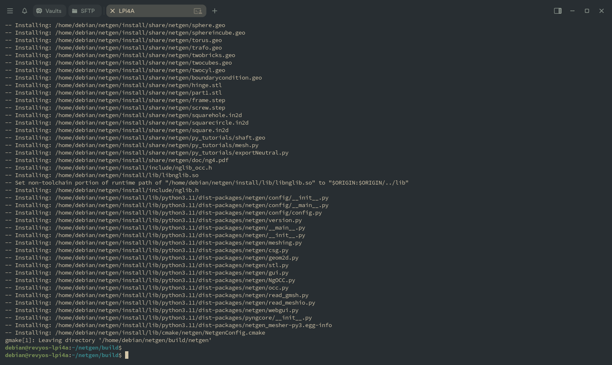
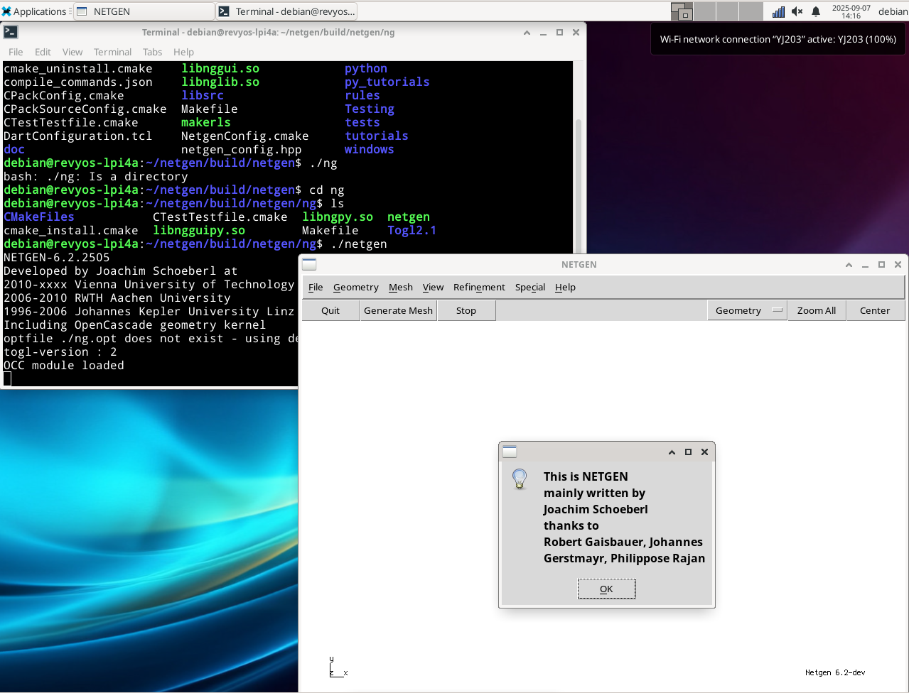
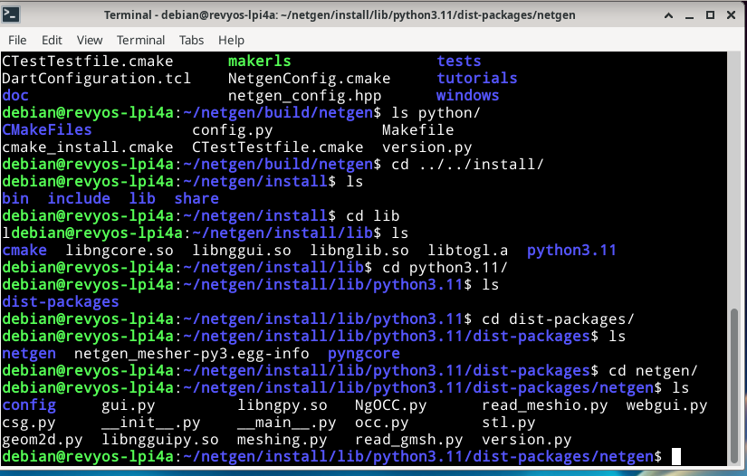

### **指南：在 RevyOS (RISC-V) 上使用 OpenCASCADE 构建 Netgen/NGSolve**

本文档提供了在运行 RevyOS 的 RISC-V 设备上从源代码构建 Netgen/NGSolve 有限元软件的说明。该过程详细说明了如何链接到手动编译的 OpenCASCADE Technology (OCCT) 库并解决平台特定的编译器问题。

官方文档：[Netgen/NGSolve - 在 Linux 上构建](https://ngsolve.org/docu/latest/install/source.html)

#### 先决条件

构建过程需要许多开发包。工作的 C++ 工具链 (`g++`)、`git` 和 `cmake` 是必需的。

本指南还假设您已经从源代码构建并安装了 OpenCASCADE Technology。这里描述的构建过程将链接到该现有安装。您可以参考此仓库中的文档：[链接](../OpenCASCADE/README.md)。

以下命令可用于在像 RevyOS 这样的基于 Debian 的系统上安装所需的依赖项：

```bash
sudo apt-get update && sudo apt-get -y install \
    g++ \
    git \
    cmake \
    python3-dev \
    python3-tk \
    tk-dev \
    tcl-dev \
    libxmu-dev \
    libglu1-mesa-dev \
    liblapacke-dev \
    libx11-dev \
    libxext-dev \
    libxi-dev
```

#### 步骤 1：获取源代码

首先，从 GitHub 克隆源代码仓库。重要的是检出特定的版本标签并初始化 git 子模块，这些子模块是 `pybind11` 等依赖项所必需的。

```bash
# 克隆仓库
git clone https://github.com/NGSolve/netgen.git

# 进入源代码目录
cd netgen

# 检出最新版本（文档时是 6.2.2505）
git checkout v6.2.2505

# 初始化并下载所需的子模块
git submodule update --init --recursive
```

#### 步骤 2：为 RISC-V 修改构建配置

默认构建配置尝试使用 `-march=native` 编译器标志进行性能优化。在某些 RISC-V 工具链（RevyOS 20250420 GCC）上，此标志不受支持，将导致构建失败。

要解决此问题，必须在项目的主 `CMakeLists.txt` 文件中直接禁用此选项。

1.  使用文本编辑器打开 `netgen` 源代码目录根目录中的 `CMakeLists.txt` 文件。
    ```bash
    nano CMakeLists.txt
    ```

2.  找到以下行（您可以搜索 `ENABLE_NATIVE_ARCH`）：
    ```cmake
    option(ENABLE_NATIVE_ARCH "Enable native architecture optimizations" ON)
    ```

3.  将值从 `ON` 更改为 `OFF`：
    ```cmake
    option(ENABLE_NATIVE_ARCH "Enable native architecture optimizations" OFF)
    ```

4.  保存文件并退出编辑器。

#### 步骤 3：使用 CMake 配置构建

源代码准备就绪后，为构建过程和最终安装创建单独的目录。然后，运行 `cmake` 来配置项目，将其指向您预构建的 OpenCASCADE 安装。

```bash
# 仍在 'netgen' 源代码目录中
mkdir build
mkdir install

# 进入构建目录
cd build

# 运行 cmake 配置构建
cmake -DOpenCASCADE_DIR=/home/debian/OCCT-7_9_1/build -DCMAKE_INSTALL_PREFIX=../install ..
```
*   `-DOpenCASCADE_DIR=/home/debian/OCCT-7_9_1/build`：指定包含 `OpenCASCADEConfig.cmake` 文件的 OCCT 安装构建目录的路径。（但似乎配置只是忽略了这个，最好在 OpenCASCADE 构建步骤中使用 `sudo make install`）
*   `-DCMAKE_INSTALL_PREFIX=../install`：设置 `make install` 步骤的目标目录。
*   `..`：指向包含主 `CMakeLists.txt` 的源代码目录。

#### 步骤 4：编译和安装

成功配置后，继续编译源代码。

```bash
# 使用所有可用的处理器核心编译项目
make -j$(nproc)

# 将编译的文件安装到前缀目录
make install
```

**注意：** 在编译过程中，您可能会看到诸如 `"Unsupported CPU architecture"` 的警告。这些是非致命的，可以忽略。构建将继续并产生功能库。

成功安装的最终输出如下图所示。



#### 步骤 5：安装后环境设置

要使用新安装的 Netgen/NGSolve，您必须配置几个环境变量，以便系统可以定位可执行文件和 Python 库。

1.  打开 shell 配置文件进行编辑。
    ```bash
    nano ~/.bashrc
    ```

2.  将以下行添加到文件末尾。如果您使用了不同的安装目录，请调整路径。
    ```bash
    export NETGENDIR="/home/debian/netgen/install/bin"
    export PATH="$NETGENDIR:$PATH"
    export PYTHONPATH="/home/debian/netgen/install/lib/python3.11/dist-packages:$PYTHONPATH"
    ```

3.  保存文件并将更改应用到当前终端会话。
    ```bash
    source ~/.bashrc
    ```

#### 验证

设置环境变量后，您可以通过从命令行运行 `netgen` 可执行文件来验证安装。图形用户界面应该成功启动。




