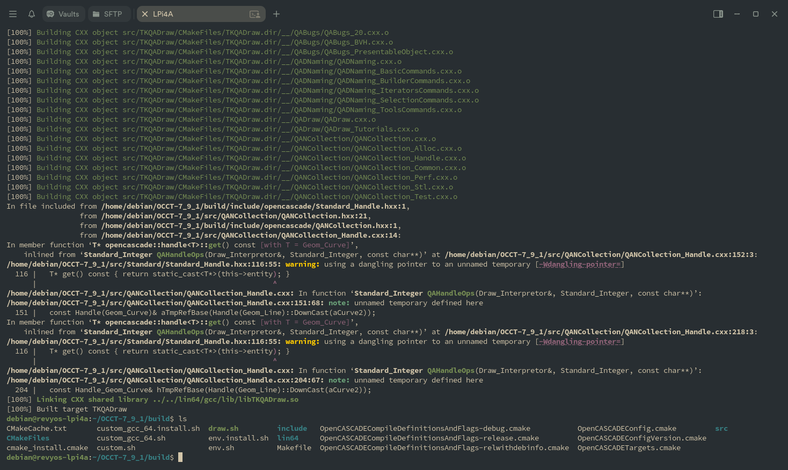
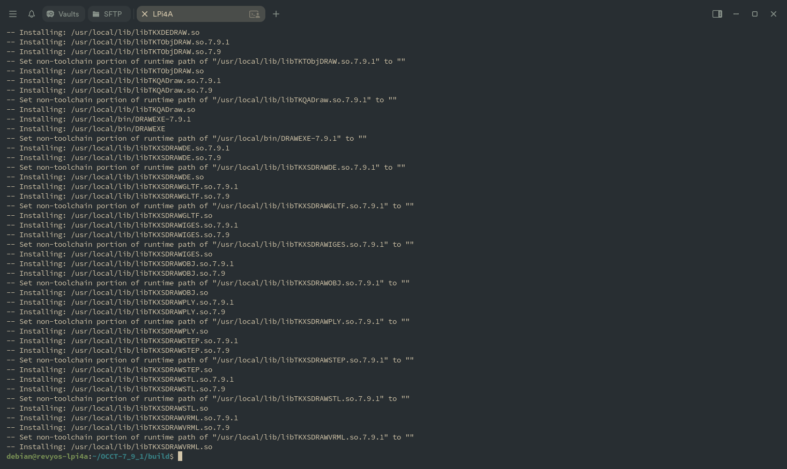

### **Guide: Building/Installing OpenCASCADE on RevyOS**

There are some precompiled OpenCASCADE packages for RISC-V in the RevyOS repositories. For those packages, you could just install them with `apt`:

```bash
debian@revyos-lpi4a:~$ apt search opencascade
freecad/sid 0.20.2+dfsg1-4 all
  Extensible Open Source CAx program

freecad-common/sid 0.20.2+dfsg1-4 all
  Extensible Open Source CAx program - common files

freecad-python3/sid 0.20.2+dfsg1-4 riscv64
  Extensible Open Source CAx program - Python 3 binaries

libfreecad-python3-0.20/sid 0.20.2+dfsg1-4 riscv64
  Extensible Open Source CAx program - Python 3 library files

liboce-foundation-dev/sid 0.18.3-2+b1 riscv64
  OpenCASCADE Community Edition CAE platform library development files

liboce-foundation11/sid 0.18.3-2+b1 riscv64
  OpenCASCADE Community Edition CAE platform shared library

liboce-modeling-dev/sid 0.18.3-2+b1 riscv64
  OpenCASCADE Community Edition CAE platform library development files

liboce-modeling11/sid 0.18.3-2+b1 riscv64
  OpenCASCADE Community Edition CAE platform shared library

liboce-ocaf-dev/sid 0.18.3-2+b1 riscv64
  OpenCASCADE Community Edition CAE platform library development files

liboce-ocaf-lite-dev/sid 0.18.3-2+b1 riscv64
  OpenCASCADE Community Edition CAE platform library development files

liboce-ocaf-lite11/sid 0.18.3-2+b1 riscv64
  OpenCASCADE Community Edition CAE platform shared library

liboce-ocaf11/sid 0.18.3-2+b1 riscv64
  OpenCASCADE Community Edition CAE platform shared library

liboce-visualization-dev/sid 0.18.3-2+b1 riscv64
  OpenCASCADE Community Edition CAE platform library development files

liboce-visualization11/sid 0.18.3-2+b1 riscv64
  OpenCASCADE Community Edition CAE platform shared library

oce-draw/sid 0.18.3-2+b1 riscv64
  OpenCASCADE Community Edition CAE platform shared library
```

---

This document provides instructions for building OpenCASCADE Technology on a RISC-V device running the RevyOS Debian derivative.

Official documentation: [Building OpenCASCADE Technology](https://dev.opencascade.org/doc/overview/html/build_upgrade__building_occt.html)

The source code I used was from: https://github.com/Open-Cascade-SAS/OCCT/archive/refs/tags/V7_9_1.tar.gz

#### Building OpenCASCADE Technology (OCCT) on RISC-V

OCCT is a software development platform for 3D modeling, CAD data exchange, and visualization.

##### Prerequisites

You usually need to rebuild OCCT on your own platform (OS, compiler) for binary compatibility.

##### Documentation

- Local: `dox/build/build_occt/building_occt.md`
- Online: [Building OCCT](https://dev.opencascade.org/doc/overview/html/build_upgrade__building_occt.html)
- Wiki: [Building OCCT Wiki](https://dev.opencascade.org/doc/overview/html/build_upgrade__building_occt.html)

##### Basic Build Steps

Assuming you have extracted OCCT-7_9_1 source:

```bash
cd OCCT-7_9_1
mkdir build
cd build
cmake ..
make -j$(nproc)
```

Version info is in `adm/cmake/version.cmake`.

##### Troubleshooting: Missing Dependencies

If you see errors about missing TCL/TK headers:

```bash
sudo apt install tcl-dev tk-dev
sudo apt install libfreetype6-dev libgl1-mesa-dev libglu1-mesa-dev libx11-dev libxext-dev libxrandr-dev libxcursor-dev libxinerama-dev libxi-dev
sudo apt install cmake-curses-gui  # for ccmake, the TUI/GUI could be used to toggle off libfreetype, which got conflicting issues on RevyOS repo 20250907, may cause build failure.
```

If `cmake` still can't find libraries, you could specify paths manually:

```bash
cmake .. \
  -D3RDPARTY_TCL_INCLUDE_DIR=/usr/include/tcl8.6 \
  -D3RDPARTY_TK_INCLUDE_DIR=/usr/include/tk8.6
```

Find TCL/TK header locations:

```bash
find /usr/include -name "tcl.h"
find /usr/include -name "tk.h"
dpkg -l | grep -E "(tcl|tk).*dev"
```

##### Successful Configuration Output

If configuration succeeds, you'll see messages like:

- TCL and TK detected
- Xlib enabled
- OCCT headers collected
- Build files generated

##### Compile and Install

```bash
make -j$(nproc)
sudo make install
# or custom install dir
make install DESTDIR=/path/to/custom/install/dir
```

##### Notes

Some options (e.g. VTK, FreeImage) may be disabled. Install dependencies and re-run `ccmake ..` to enable them if needed.

##### Built Packages




When you see `make` done like this, you could install the built libraries and headers with `sudo make install`.

