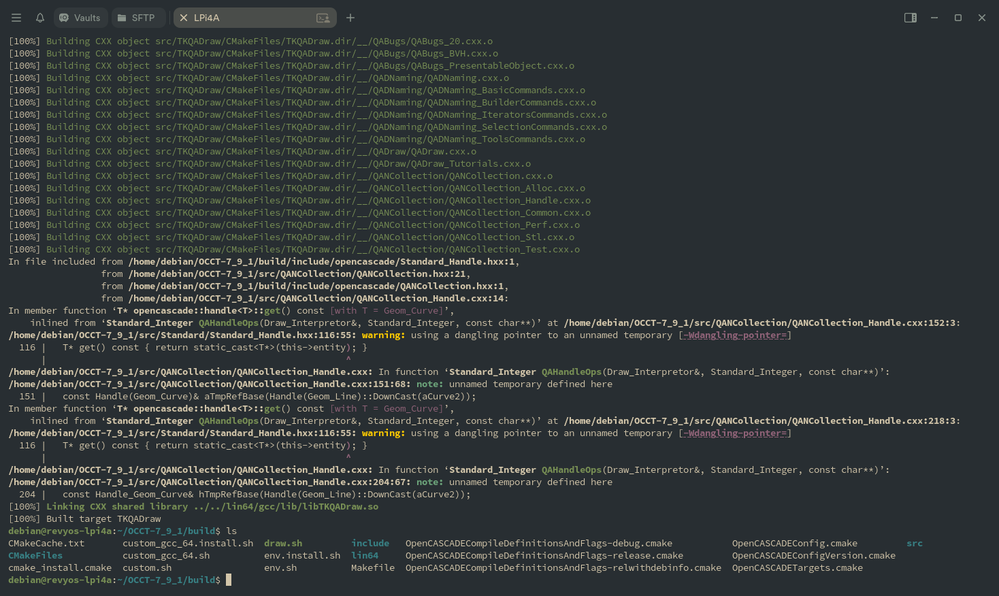
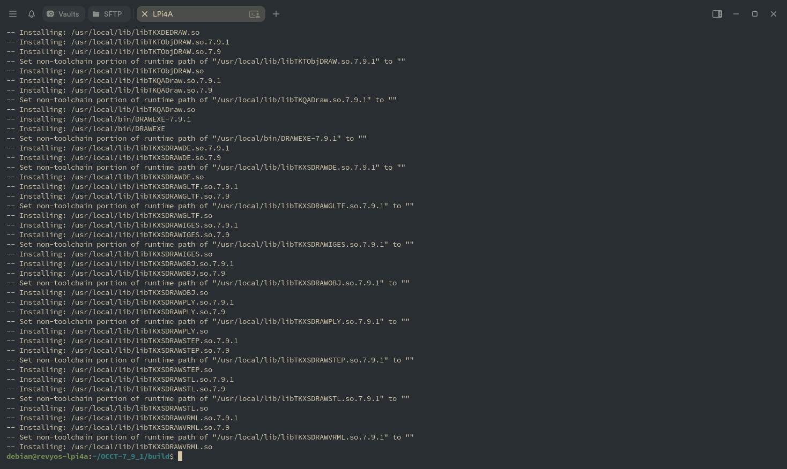

### **指南：在 RevyOS 上构建/安装 OpenCASCADE**

RevyOS 仓库中有一些针对 RISC-V 的预编译 OpenCASCADE 包。对于这些包，您可以使用 `apt` 安装它们：

```bash
debian@revyos-lpi4a:~$ apt search opencascade
freecad/sid 0.20.2+dfsg1-4 all
  Extensible Open Source CAx program

freecad-common/sid 0.20.2+dfsg1-4 all
  Extensible Open Source CAx program - common files

freecad-python3/sid 0.20.2+dfsg1-4 riscv64
  Extensible Open Source CAx program - Python 3 binaries

libfreecad-python3-0.20/sid 0.20.2+dfsg1-4 riscv64
  Extensible Open Source CAx program - Python 3 library files

liboce-foundation-dev/sid 0.18.3-2+b1 riscv64
  OpenCASCADE Community Edition CAE platform library development files

liboce-foundation11/sid 0.18.3-2+b1 riscv64
  OpenCASCADE Community Edition CAE platform shared library

liboce-modeling-dev/sid 0.18.3-2+b1 riscv64
  OpenCASCADE Community Edition CAE platform library development files

liboce-modeling11/sid 0.18.3-2+b1 riscv64
  OpenCASCADE Community Edition CAE platform shared library

liboce-ocaf-dev/sid 0.18.3-2+b1 riscv64
  OpenCASCADE Community Edition CAE platform library development files

liboce-ocaf-lite-dev/sid 0.18.3-2+b1 riscv64
  OpenCASCADE Community Edition CAE platform library development files

liboce-ocaf-lite11/sid 0.18.3-2+b1 riscv64
  OpenCASCADE Community Edition CAE platform shared library

liboce-ocaf11/sid 0.18.3-2+b1 riscv64
  OpenCASCADE Community Edition CAE platform shared library

liboce-visualization-dev/sid 0.18.3-2+b1 riscv64
  OpenCASCADE Community Edition CAE platform library development files

liboce-visualization11/sid 0.18.3-2+b1 riscv64
  OpenCASCADE Community Edition CAE platform shared library

oce-draw/sid 0.18.3-2+b1 riscv64
  OpenCASCADE Community Edition CAE platform shared library
```

---

本文档提供了在运行 RevyOS Debian 衍生物的 RISC-V 设备上构建 OpenCASCADE Technology 的说明。

官方文档：[构建 OpenCASCADE Technology](https://dev.opencascade.org/doc/overview/html/build_upgrade__building_occt.html)

我使用的源代码来自：https://github.com/Open-Cascade-SAS/OCCT/archive/refs/tags/V7_9_1.tar.gz

#### 在 RISC-V 上构建 OpenCASCADE Technology (OCCT)

OCCT 是一个用于 3D 建模、CAD 数据交换和可视化的软件开发平台。

##### 先决条件

您通常需要在自己的平台（操作系统、编译器）上重新构建 OCCT 以获得二进制兼容性。

##### 文档

- 本地：`dox/build/build_occt/building_occt.md`
- 在线：[构建 OCCT](https://dev.opencascade.org/doc/overview/html/build_upgrade__building_occt.html)
- Wiki：[构建 OCCT Wiki](https://dev.opencascade.org/doc/overview/html/build_upgrade__building_occt.html)

##### 基本构建步骤

假设您已提取 OCCT-7_9_1 源代码：

```bash
cd OCCT-7_9_1
mkdir build
cd build
cmake ..
make -j$(nproc)
```

版本信息在 `adm/cmake/version.cmake` 中。

##### 故障排除：缺少依赖项

如果您看到关于缺少 TCL/TK 头文件的错误：

```bash
sudo apt install tcl-dev tk-dev
sudo apt install libfreetype6-dev libgl1-mesa-dev libglu1-mesa-dev libx11-dev libxext-dev libxrandr-dev libxcursor-dev libxinerama-dev libxi-dev
sudo apt install cmake-curses-gui  # 用于 ccmake，TUI/GUI 可用于关闭 libfreetype，这在 RevyOS 仓库 20250907 上有冲突问题，可能导致构建失败。
```

如果 `cmake` 仍然找不到库，您可以手动指定路径：

```bash
cmake .. \
  -D3RDPARTY_TCL_INCLUDE_DIR=/usr/include/tcl8.6 \
  -D3RDPARTY_TK_INCLUDE_DIR=/usr/include/tk8.6
```

查找 TCL/TK 头文件位置：

```bash
find /usr/include -name "tcl.h"
find /usr/include -name "tk.h"
dpkg -l | grep -E "(tcl|tk).*dev"
```

##### 成功配置输出

如果配置成功，您将看到如下消息：

- TCL 和 TK 已检测到
- Xlib 已启用
- OCCT 头文件已收集
- 构建文件已生成

##### 编译和安装

```bash
make -j$(nproc)
sudo make install
# 或自定义安装目录
make install DESTDIR=/path/to/custom/install/dir
```

##### 注意事项

某些选项（例如 VTK、FreeImage）可能被禁用。如果需要，请安装依赖项并重新运行 `ccmake ..` 来启用它们。

##### 构建包



当您看到 `make` 像这样完成时，您可以使用 `sudo make install` 安装构建的库和头文件。


