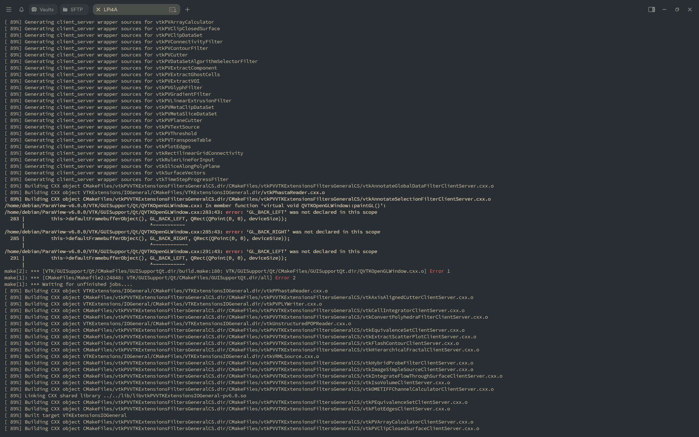

### **指南：在 RevyOS (RISC-V) 上构建 ParaView**

RevyOS 仓库中有针对 RISC-V 的预编译 ParaView 包。对于这些包，可以尝试使用 `apt` 安装它们。

```bash
debian@revyos-lpi4a:~$ apt search paraview
paraview/sid 5.10.1-2+b1 riscv64
  Parallel Visualization Application

paraview-dbgsym/sid 5.10.1-2+b1 riscv64
  debug symbols for paraview

paraview-dev/sid 5.10.1-2+b1 riscv64
  Parallel Visualization Application. Development header files

...
```
但是，在测试系统（RevyOS 镜像 20250420）上的安装由于对过时库版本（`libgdal31`、`libtiff5`）的未解决依赖而失败，需要从源代码构建。

```bash
debian@revyos-lpi4a:~$ sudo apt install paraview
[sudo] password for debian: 
Some packages could not be installed. This may mean that you have
requested an impossible situation or if you are using the unstable
distribution that some required packages have not yet been created
or been moved out of Incoming.
The following information may help to resolve the situation:

Unsatisfied dependencies:
 paraview : Depends: libgdal31 (>= 3.0.0) but it is not installable
            Depends: libtiff5 (>= 4.0.3) but it is not installable
            Recommends: python3-paraview but it is not going to be installed
            Recommends: paraview-doc but it is not going to be installed
Error: Unable to correct problems, you have held broken packages.
debian@revyos-lpi4a:~$ debian@revyos-lpi4a:~$ sudo apt install paraview
[sudo] password for debian: 
Some packages could not be installed. This may mean that you have
requested an impossible situation or if you are using the unstable
distribution that some required packages have not yet been created
or been moved out of Incoming.
The following information may help to resolve the situation:

Unsatisfied dependencies:
 paraview : Depends: libgdal31 (>= 3.0.0) but it is not installable
            Depends: libtiff5 (>= 4.0.3) but it is not installable
            Recommends: python3-paraview but it is not going to be installed
            Recommends: paraview-doc but it is not going to be installed
Error: Unable to correct problems, you have held broken packages.
```

---

本文档记录了在运行 RevyOS 的 TH1520 Lichee Pi 4A 板上从源代码构建 ParaView v6.0.0 的尝试。

官方网站：[ParaView 主页](https://www.paraview.org/)

使用的源代码来自：https://www.paraview.org/files/v6.0/ParaView-v6.0.0.tar.xz

#### 在 RISC-V 上构建 ParaView v6.0.0

ParaView 是一个开源、多平台的数据分析和可视化应用程序。本指南详细说明了在 RISC-V 平台上编译它的过程。

##### 先决条件

需要标准的 C++ 开发环境和几个库。安装了以下包以满足初始依赖项：

```bash
sudo apt-get install build-essential cmake git \
    qtbase5-dev qttools5-dev libqt5x11extras5-dev \
    libgl1-mesa-dev libglu1-mesa-dev \
    python3-dev libopenmpi-dev \
    libhdf5-dev zlib1g-dev
```

##### 尝试的构建步骤

使用以下程序配置和启动构建。

1.  **下载并提取源代码：**
    ```bash
    wget https://www.paraview.org/files/v6.0/ParaView-v6.0.0.tar.xz
    tar -xvf ParaView-v6.0.0.tar.xz
    ```

2.  **使用 CMake 配置：**
    创建了构建目录并运行 CMake 来配置项目。
    ```bash
    cd ParaView-v6.0.0
    mkdir build
    cd build
    cmake -DCMAKE_INSTALL_PREFIX=~/paraview-install -DCMAKE_BUILD_TYPE=Release ..
    ```

##### 故障排除和失败点

构建过程在遇到不可恢复的编译错误之前遇到并解决了几个问题。

1.  **缺少 Qt 模块：** 由于缺少 Qt 组件，初始 CMake 配置失败。通过安装相应的开发包解决了这些问题：
    ```bash
    sudo apt install libqt5svg5-dev
    sudo apt install qtxmlpatterns5-dev-tools
    ```

2.  **最终编译错误：** 构建进展到大约 90% 完成，然后在 VTK 模块中出现一致错误：
    ```
    /home/debian/ParaView-v6.0.0/VTK/GUISupport/Qt/QVTKOpenGLWindow.cxx:283:43: error: 'GL_BACK_LEFT' was not declared in this scope
    /home/debian/ParaView-v6.0.0/VTK/GUISupport/Qt/QVTKOpenGLWindow.cxx:285:43: error: 'GL_BACK_RIGHT' was not declared in this scope
    ```



##### 分析和结论

最终错误表明 ParaView v6.0.0 源代码与此 RISC-V 平台上 Mesa 图形驱动程序提供的 OpenGL 环境之间存在根本性不兼容。

宏 `GL_BACK_LEFT` 和 `GL_BACK_RIGHT` 是传统完整桌面 OpenGL 规范的一部分，专门用于立体渲染。此嵌入式平台上的图形驱动程序似乎提供现代 OpenGL Core Profile 或 OpenGL ES (GLES) 实现，这些实现已弃用并移除了这些固定功能宏。

尝试通过强制基于 EGL 的配置（`-DVTK_OPENGL_HAS_EGL=ON`）来解决此问题并没有改变结果。

**软件无法在不修补源代码的情况下构建** 以移除或条件编译依赖这些传统 OpenGL 功能的部分。这是为使用现代基于 GLES 驱动程序的 ARM 和其他嵌入式架构构建 VTK 和 ParaView 时的已知问题。

##### 进一步阅读

有兴趣将 ParaView 移植到此平台的开发人员应查阅以下资源，这些资源讨论了类似问题和潜在的修补策略：

*   VTK Discourse 关于为 ARM64 构建 OpenGL ES：
    [https://discourse.vtk.org/t/building-vtk-for-arm64-with-opengl-es/707/6](https://discourse.vtk.org/t/building-vtk-for-arm64-with-opengl-es/707/6)

*   ParaView Discourse 关于 ARM 构建失败：
    [https://discourse.paraview.org/t/fail-to-build-paraview-for-arm-arch/6928/2](https://discourse.paraview.org/t/fail-to-build-paraview-for-arm-arch/6928/2)

*   Gentoo 错误报告讨论类似的 OpenGL 宏问题：
    [https://bugs.gentoo.org/945731](https://bugs.gentoo.org/945731)
