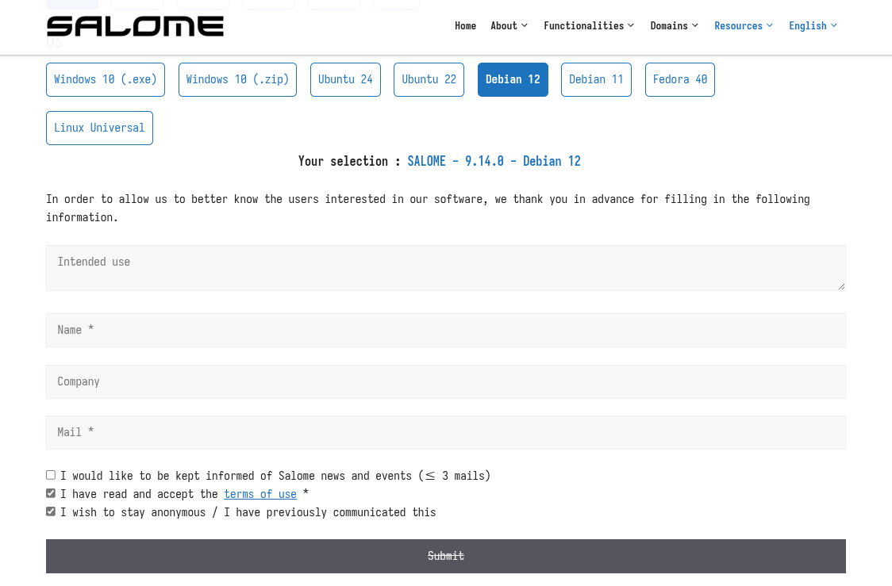
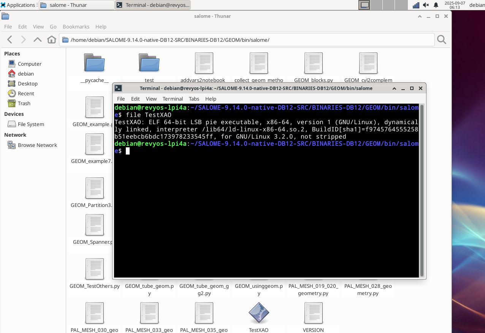

您可以从[这里](https://www.salome-platform.org/)下载 SALOME-9.14.0 for Debian 12。

由于 SALOME 只提供 x86 二进制文件，无法在 RISC-V 上测试或验证。（也许一些 box64 模拟可以工作但尚未测试。）

SALOME 提供了从源代码构建的方式。完整的构建说明可在以下链接找到：[从源代码构建 SALOME（使用 CMake）](https://docs.salome-platform.org/latest/dev/cmake/html/intro.html)。

需要进行进一步的测试和构建。
